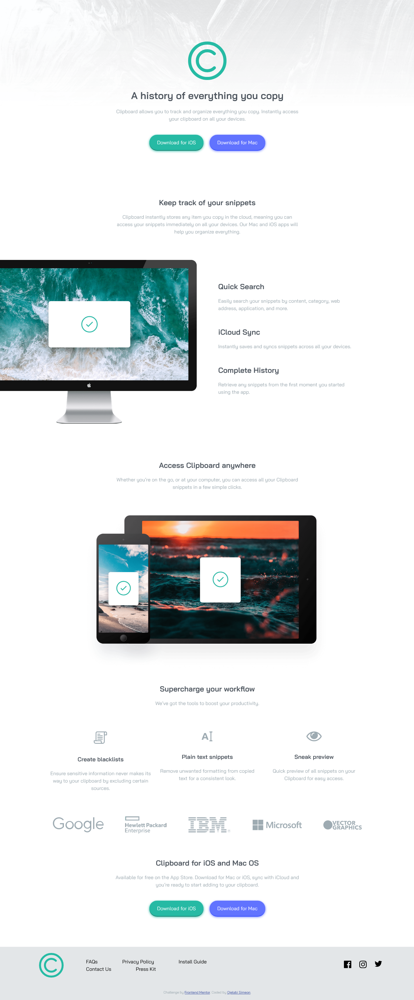

# Frontend Mentor - Clipboard landing page solution

This is a solution to the [Clipboard landing page challenge on Frontend Mentor](https://www.frontendmentor.io/challenges/clipboard-landing-page-5cc9bccd6c4c91111378ecb9). Frontend Mentor challenges help you improve your coding skills by building realistic projects. 

## Table of contents

- [Overview](#overview)
  - [The challenge](#the-challenge)
  - [Screenshot](#screenshot)
  - [Links](#links)
- [My process](#my-process)
  - [Built with](#built-with)
  - [What I learned](#what-i-learned)
  - [Continued development](#continued-development)
  - [Useful resources](#useful-resources)
- [Author](#author)
- [Acknowledgments](#acknowledgments)


## Overview

### The challenge

Users should be able to:

- View the optimal layout for the site depending on their device's screen size
- See hover states for all interactive elements on the page

### Screenshot




### Links

- Solution URL: [github repo](https://github.com/NobleSimeon/FEM-clipboard-landing--page)
- Live Site URL: [link](https://simone-clipboard-landing-page.netlify.app)


## My process

### Built with

- Semantic HTML5 markup
- CSS custom properties
- Flexbox
- CSS Grid
- Mobile-first workflow


### What I learned

This is one of my first project

```html
<h1>Some HTML code I'm proud of</h1>
```
```css

```
```js

}
```


## Author

- Website - [Ojelabi Simeon](https://github.com/NobleSimeon)
- Frontend Mentor - [@NobleSimeon](https://www.frontendmentor.io/profile/NobleSimeon)
- Twitter - [@SimeonPelumi](https://www.twitter.com/SimeonPelumi)


